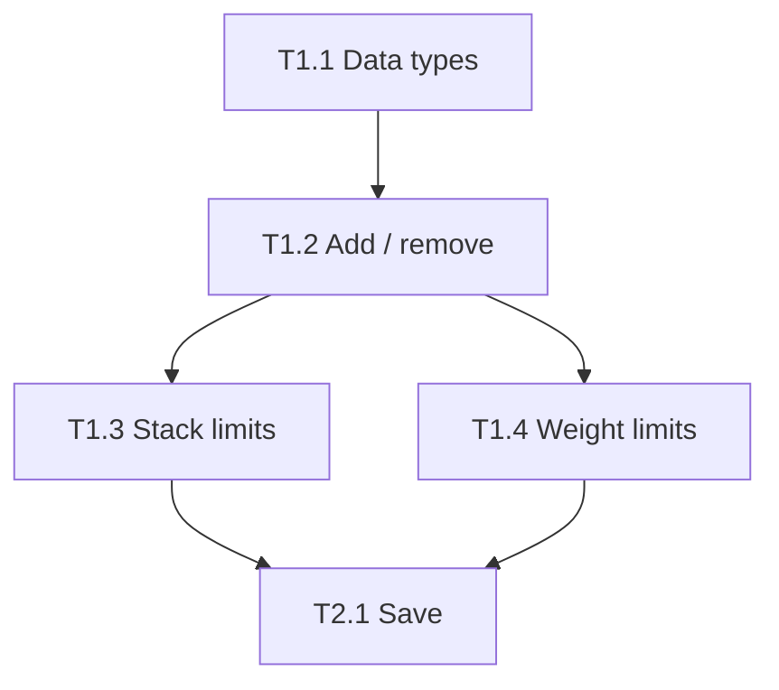

# Chapter 7: Parallel work

**In one line:** run independent tasks at the same time, but only after you've made sure they can't collide.

## When it's safe

Two tasks can run in parallel when **both** are true:

1. Neither depends on the other's output.
2. They touch **different files**.

Here T1.3 and T1.4 can run side by side. T2.1 has to wait for both.

## Rules that prevent collisions

1. **Define shared interfaces first.** If two tasks must agree on a function signature or data shape,
   write that down in a spec that finishes before either starts, or quote it in both specs.
2. **Exclusive file ownership.** Each parallel task lists its allowed files, and no file appears in two of them.
   If two tasks need the same file, they're not parallel.
3. **Separate branches or working copies.** Each implementer works on its own branch (or its own folder checkout),
   so half-finished work never mixes.
4. **Merge in dependency order,** one at a time, running the checks after each merge.

## Avoiding deadlock

Deadlock here means tasks waiting on each other forever.

- **No circular dependencies.** If A waits for B and B waits for A, you've cut the tasks wrong. Redraw them.
- **No waiting inside a task.** An implementer should never wait for another session. If it needs something
  that isn't there, it reports NEED_INFO and stops.
- **Dependencies live in the plan,** not in the implementers' heads.

## The integration task

After parallel tasks merge, add a short integration task whose only job is to confirm the pieces work together
(a few tests that use both features). Parallel work trades some integration risk for speed, and this task covers it.

## How many at once?

Fewer than you think. Parallel sessions multiply your review load, since every result needs a reviewer.
Two or three at a time is plenty for most projects. More only helps if review keeps up.

## Do this

Look at your plan and mark which tasks could run in parallel. For each pair, verify they share no files.
If they do, either split the shared file or run them in sequence.

**Next:** [Chapter 8: Adversarial review](08-adversarial-review.md)
