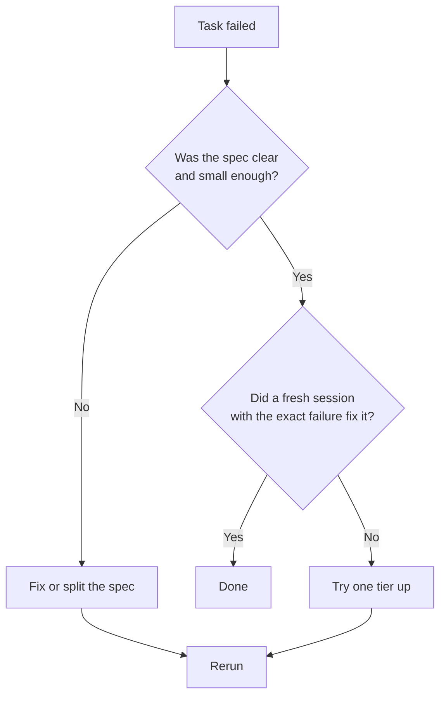

# Chapter 9: Handling failures

**In one line:** diagnose first, then change the spec, the session, or the tier, in that order of preference.

Things will fail. The skill is figuring out *why*, because the fix depends on the cause.

## Diagnose before rerunning

Never just rerun the same spec hoping for a different outcome. Read what happened:

- What did the implementer's report say?
- What check failed, and with what output?
- Did it deviate from the spec, and why?

## Common failure patterns

| Symptom | Likely cause | Fix |
|---|---|---|
| Different results every run | Spec is ambiguous | Close the ambiguity; add facts |
| Many edits, tests rerun repeatedly, no progress | Thrashing | Stop, find the exact failing test, start fresh with it |
| Ends early with no report | Session gave up mid-task | Start fresh, or ask it to continue once |
| Touches files it shouldn't | Allowed-files list missing or ignored | Tighten the list; add to out of scope |
| Tests pass but the reviewer finds bugs | Weak tests | Add breaks; strengthen test requirements |
| Fails on every attempt | Task too big or too hard for this tier | Split the task, or move up a tier |
| Can't find things it needs | Spec didn't carry the facts | Quote names, signatures, line references |

## The escalation ladder

Always try the cheapest fix first: the spec costs nothing, a fresh session costs a little, a higher tier costs the most.

## Spec fault or implementer fault?

Ask: *if a careful human had only this spec, would they have gotten it right?*
If not, the spec is at fault and a stronger model is a very expensive way to paper over it.

## Fixing with a fresh session

When a task comes back with problems, give the next implementer session:

- the original spec,
- a numbered list of exactly what's wrong,
- nothing else.

Resist the urge to continue the old session. Its history is part of the problem.

## When to escalate to a stronger tier

Only after the spec is clear, the task is small, and a fresh session still fails. Even then, escalate for that
task only, then go back to the cheaper tier for the next one.

## Do this

Next time something fails, write one sentence on the cause before you do anything else.
Over time you'll see which causes show up most, and that tells you where to improve.

**Next:** [Chapter 10: Measuring savings](10-measuring-savings.md)
