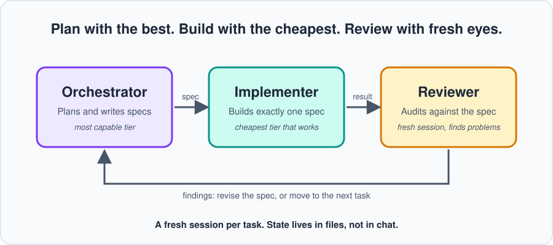

<p align="center">
  
</p>

# Orca

**A model-agnostic orchestration workflow for AI-assisted development.**
Spend your expensive tokens on thinking, not typing.

Maintained by the [AI Game Dev](https://aigamedevs.org) community.

[Website](https://aigamedevs.org) · [Discord](https://discord.gg/GGszfGZg8a) · [Guide](guide/README.md) · [Worked example](examples/inventory)



---

## The idea in 30 seconds

Most people use their most capable (and most expensive) model for everything: planning, writing code, fixing bugs. That burns through token budgets fast, and it usually isn't necessary.

Orca splits the work into three roles:

| Role | Job | Tier |
|------|-----|-------|
| **Orchestrator** | Plans the project and writes precise specs | Most capable tier |
| **Implementer** | Follows one spec and builds it | Cheapest tier that does it reliably |
| **Reviewer** | Independently audits the result against the spec | Strong tier, **fresh session** |

The top tier rarely writes the implementation. It writes the *instructions* for it.

## The six principles

1. **One outcome per spec.** Small, focused tasks finish more often and are easier to verify. If a spec feels big, split it.
2. **Specs carry the facts.** Include the names, signatures, constraints, and decisions the implementer needs. Don't make it hunt for context or guess.
3. **Tests first, and prove they can fail.** Write the test, watch it fail for the right reason, then implement. Deliberately break the code once to confirm the test catches it.
4. **Define "done" mechanically.** A checklist anyone can verify: the checks pass, only the intended files changed, no tests were quietly removed.
5. **Never let the builder grade itself.** A separate session reviews the output against the spec, without seeing the builder's own summary.
6. **Fresh session per task, state in files.** Plans, specs, and decisions live in the repo, not in chat history. Any session can be dropped and restarted without losing progress.

## Why it works

- **Token efficiency:** implementation is the bulk of token use, and it moves to cheaper tiers.
- **Fewer errors:** narrow specs leave less room for improvisation.
- **Less drift:** clean sessions working from written specs don't accumulate a long, muddy history.
- **Independent review:** a reviewer with fresh context doesn't share the implementer's assumptions.
- **Parallelism:** well-scoped specs with clear file ownership can run in several sessions at once.

> These are benefits observed in practice, not guarantees. Cheaper tiers need tighter specs, and writing good specs costs orchestrator tokens. The guide covers the tradeoffs.

## Works with anything

Orca doesn't depend on a specific model, vendor, or tool. If your setup lets you run more than one session or agent, you can use it.

## What's in this repo

```
Orca/
├── README.md        You are here
├── AGENTS.md        Drop-in instructions for agents
├── guide/           The full guide, chapter by chapter
├── templates/       Spec and review templates
├── assets/          Diagrams used in the guide
└── examples/        A worked example, from spec to accepted
```

## Quickstart

1. Copy `AGENTS.md` and the `templates/` folder into your project.
2. Start an **orchestrator** session. Describe your project and have it produce a phased plan (`docs/plan.md`).
3. For the **next phase only**, have the orchestrator write a spec per task using `templates/spec.md`. Later phases get specced after earlier ones finish, since results change the plan.
4. Hand each spec to an **implementer** session on a cheaper tier.
5. Open a **fresh reviewer** session. Give it the spec and the result, and ask it to find problems.
6. Return the findings to the orchestrator. Fix, then move to the next phase.

## Status

First full draft. Start with the [guide index](guide/README.md), or jump to the [worked example](examples/inventory).

## Community

Questions, results, and war stories are welcome in the [AI Game Dev Discord](https://discord.gg/GGszfGZg8a).
If you try Orca on a real project, we'd love to hear how it went.

## Contributing

Issues and suggestions are welcome.

## License

TBD
