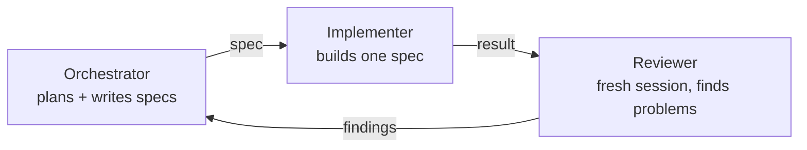
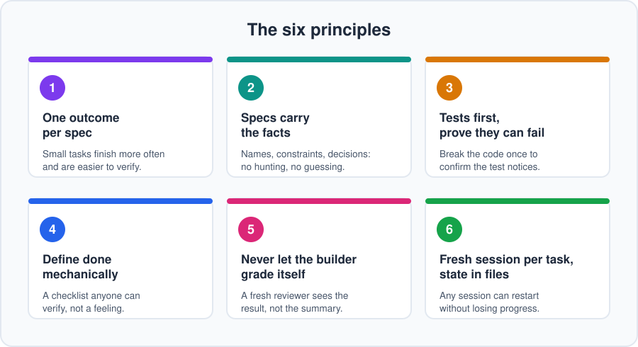

# Chapter 1: The core idea

**In one line:** use your most capable model to think and write instructions, and a cheaper one to carry them out.

## The problem

Most people open one session with their best model and do everything in it: planning, coding, debugging, rewriting.
It works, but it's expensive in two ways:

- **Tokens.** Writing and rewriting code is where most tokens go, and you're paying top-tier prices for it.
- **Quality.** Long sessions pile up history. The model starts leaning on stale assumptions, forgets early decisions,
  and drifts from what you originally asked for.

## The shift

Implementation is mostly *following instructions*. That rarely needs your best model. What does need it is the
work that comes before: deciding what to build, how to break it up, and what "correct" looks like.

So split the work:

| Role | Does | Use |
|------|------|-----|
| **Orchestrator** | Plans the project, writes precise specs, makes decisions | Your most capable tier |
| **Implementer** | Builds exactly one spec | The cheapest tier that does it reliably |
| **Reviewer** | Audits the result against the spec | A strong tier, in a **fresh session** |

The orchestrator's output is *text that tells someone else what to build*. That's cheap compared with building it.

## Why the review step matters

A model reviewing its own work in the same session tends to agree with itself. It remembers why it made each choice,
so it explains problems away instead of seeing them.

A reviewer in a fresh session has none of that. It sees the spec and the result, and nothing else. That independence
is what makes it useful. It doesn't need to be a different model, just a different, clean session.

## What this does for you

- **Lower token spend:** the expensive tier only writes plans and specs.
- **Fewer errors:** narrow, written specs leave less room to improvise.
- **Less drift:** every task starts clean and works from a file, not from a long chat history.
- **Faster work:** well-scoped specs can run in parallel (Chapter 7).

These are benefits you'll see in practice, but they aren't automatic. Cheaper models need clearer specs, and
writing good specs takes effort. The rest of this guide is about doing that well.

## The six principles

1. **One outcome per spec.**
2. **Specs carry the facts.**
3. **Tests first, and prove they can fail.**
4. **Define "done" mechanically.**
5. **Never let the builder grade itself.**
6. **Fresh session per task, state in files.**

Each one gets its own treatment in the chapters ahead.

## Do this

Before the next chapter, pick a small project idea you'd actually like to build. We'll use a running example
(an inventory system for a 2D game) in the examples, but follow along with your own if you prefer.

**Next:** [Chapter 2: Choosing a stack](02-choosing-a-stack.md)
